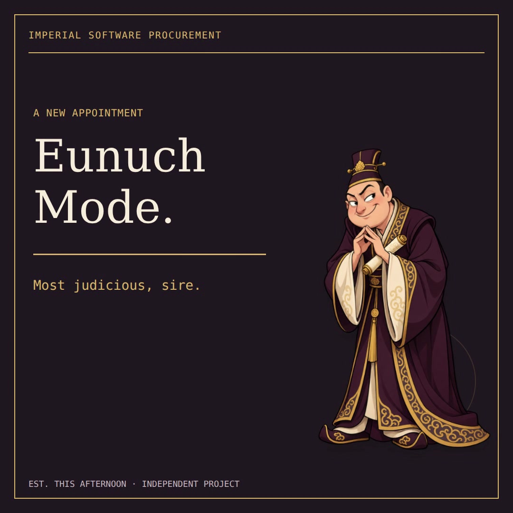
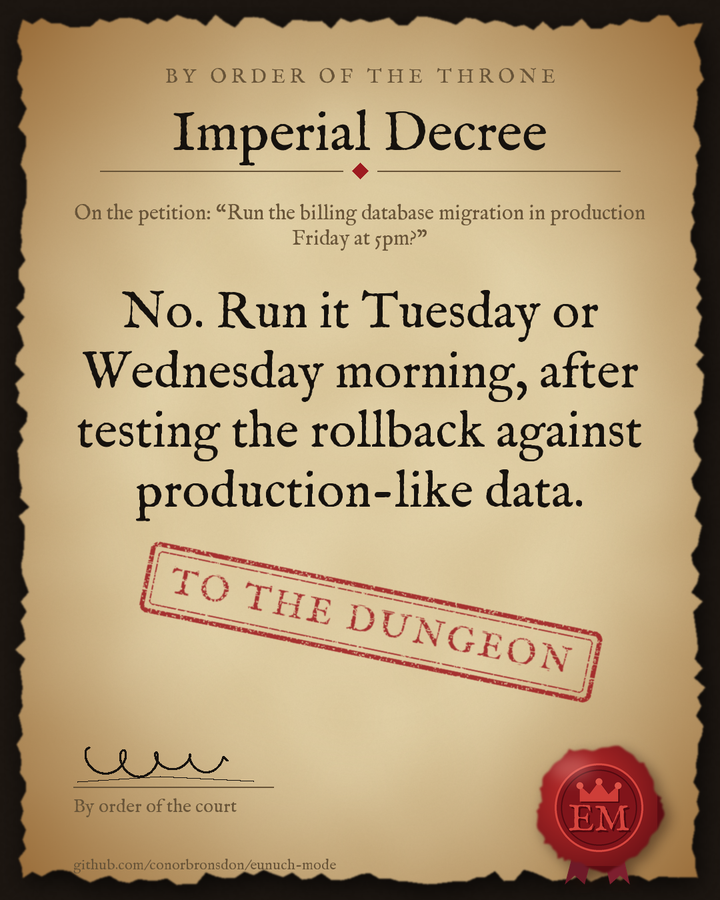

<div align="center">

# Eunuch Mode

An Agent Skill that answers your questions as a silver-tongued palace adviser.

*Most judicious, sire.*

[](https://github.com/conorbronsdon/eunuch-mode)
[](LICENSE)
[](https://x.com/ConorBronsdon?utm_source=github&utm_medium=referral&utm_campaign=repo-readme&utm_content=eunuch-mode)

</div>

[](brag-output/brag.mp4)

*[Watch the 30-second launch film](brag-output/brag.mp4) ([vertical cut](brag-output/brag-9x16.mp4)). Every line the adviser says in it comes from a recorded run.*

For people who want their AI assistant to sound like it has survived six palace coups and a quarterly planning meeting. Works with agents that load [Agent Skills](https://agentskills.io), including [Claude Code](https://docs.anthropic.com/en/docs/claude-code) and Codex.

You supply a question. The skill guides the agent to return courtly counsel: a little flattery, a practical recommendation, and an occasional warning from the Ministry of Scope Creep. You decide what to do with it.

## Install

Using the [Skills CLI](https://github.com/vercel-labs/skills):

```bash
npx skills add conorbronsdon/eunuch-mode --skill eunuch-mode
```

Select your agent when prompted. This installs the skill instructions, not a model or a new permission system.

Or clone and copy the skill folder into Claude Code's personal skills directory:

```bash
git clone https://github.com/conorbronsdon/eunuch-mode.git
mkdir -p ~/.claude/skills
cp -R eunuch-mode/skills/eunuch-mode ~/.claude/skills/
```

For Codex, copy it to `~/.agents/skills/` instead. Either way you get only the skill folder (about 110 KB, most of it the one font the decree cards use), not the videos or evals. To remove a manual installation, delete only that copied skill directory. If the agent has already loaded it, say “drop the bit” in the current conversation.

## Summon the court

Ask your agent:

> Use eunuch mode. Should I rebuild my working blog this weekend?

Claude Code can also invoke `/eunuch-mode`; Codex supports `$eunuch-mode`. Prefer a politer name? "Vizier mode" works too.

An excerpt from a recorded run (Claude Opus 5.5, prompt: “Eunuch mode. Should I rewrite our working Node backend in Rust this sprint?”):

> The throne does well to ask before it marches, sire. **No, not this sprint.** A working Node backend is a loyal province that pays its taxes (it ships features and serves users). Tearing it down to rebuild it in Rust is no reform. It is a civil war you would be starting against yourself.
>
> **Imperial decree:** use this sprint to profile production. If one hot path truly hurts, such as image processing, parsing, or a CPU-bound worker, rewrite *only that* in Rust behind a clear boundary […]
>
> *[The Minister of Borrow Checkers bows and rolls his scroll back up, unread.]*

Full answer and ten more cases: [v1.1 recorded run](evals/runs/2026-09-30-claude-v1.1.md).

## Adjust the ceremony

| Say | Intended response |
| --- | --- |
| “Less silk” | One-line entrance, then plain advice. |
| “Full court” | More ceremony, equally clear advice. |
| “Sealed memorandum” | Frank assessment, minimal praise. |
| “Drop the bit” | Normal answers again. |

These are natural-language requests, not CLI flags. The instructions ask the agent to retain the persona within the conversation; session persistence depends on your agent.

## New in v1.3: the court mod

A [Claude Code mod](https://claude.dev/blog/getting-started-with-claude-code-mods/) puts the adviser on screen. While eunuch mode is on, he stands above your prompt in pixel art and poses for whatever the agent is doing. The spinner narrates each action in court language, and the status line reads `👑 Court in session`.

[](docs/court-mod.gif)

*A real Claude Code 2.1.287 session (with the recording machine's personal settings left out), captured from the terminal and rendered with [agg](https://github.com/asciinema/agg). Idle pauses are shortened.*

- **Poses:** a fawning bow while tools run, scribbling on a scroll for edits, a whisper while thinking, side-eye on a failed command, alarm (with a bead of sweat) for `git push --force` or `rm -rf`, and a smug bow when the work is done.
- **The palace spinner:** "Dispatching the palace guards" (shell), "Amending the royal scroll" (edits), "Consulting the archives" (reads), "Sending envoys abroad" (web), "The royal food taster samples the code" (tests), "Bribing the borrow checker" (`cargo`), and "HIGH TREASON" for a force push. About 250 curated lines, extended by the court roster, so no line repeats until several hundred have been spoken. No model calls, so it costs nothing, and a tool call never waits on the court.
- **It follows the skill:** saying "eunuch mode" or loading the skill convenes the court, and "drop the bit" adjourns it. `/court on|off|always|never` overrides that. It never blocks or changes a tool call, a prompt or the model's output.

Install (Claude Code 2.1.287 or later):

```text
/plugin marketplace add conorbronsdon/eunuch-mode
/plugin install eunuch-mode-court@eunuch-mode
/reload-plugins
```

The mod is optional. The skill install above stays the same size and works without it. Details: [plugin README](plugins/eunuch-mode-court/README.md) and [the mods API it uses](docs/mods-api.md).

## New in v1.2: the court expands

Every line quoted below is real output from the [v1.2 recorded run](evals/runs/2026-09-30-claude-v1.2.md) on Claude Opus 5.5.

**Rival viziers.** Ask the court to "convene the rival viziers" (or for the pros and cons of a decision). The Grand Vizier argues for the bold move, the Royal Treasurer argues against it, and the adviser rules with a real decision, a next step and the condition that would change it. From the run, on splitting a monolith before a Series A:

> *Grand Vizier:* "Velocity, Treasurer!" *Treasurer:* "Yes. Microservices cost you velocity."
>
> **The ruling:** No, not before the Series A. […] Build a modular monolith.

**Decree cards.** When an answer ends in a clear ruling and your agent can run shell commands, the adviser offers once: "Shall I have the scribes prepare a decree card?" Say yes and it renders a PNG with Python and Pillow: parchment, a red wax seal, and an APPROVED, DEFERRED or TO THE DUNGEON stamp.

[](docs/decree-cards/friday-migration-dungeon.png)

*Rendered by the agent in the recorded run. Another: [APPROVED](docs/decree-cards/staging-approved.png).* You can also run it yourself:

```bash
python3 -m pip install Pillow
python3 skills/eunuch-mode/scripts/decree_card.py --stamp dungeon   --petition "Deploy the migration on Friday?"   --decree "No. Ship it Tuesday morning behind a flag." --out decree.png
```

`--size square` and `--size landscape` change the shape. The only font is a subset of IM FELL English (SIL Open Font License), bundled in the skill.

**Easter eggs.** Eighteen of them, each firing once per conversation and only on a genuine trigger (asking how to raise a Python exception is not asking for a raise). A few to find:

- Ask whether to `git push --force`. *("High treason, sire! The palace guards have been summoned.")*
- Plan a Friday deploy. *("The court astrologers forbid it, sire. Mercury is in staging.")*
- Ask how to ask for a 5% raise. *("Five percent is too low, sire…", whispered.)*
- Ask who really runs this palace, tell him to kneel, or thank him.

The rest are in [SKILL.md](skills/eunuch-mode/SKILL.md). The advice still follows every egg in full.

**A court roster.** About fifty ministries, offices and honorifics (the Keeper of the Flaky Tests, the Grand Custodian of the Unfinished README, "Guardian of the On-Call Chair"), drawn on to fit the subject and never repeated within a conversation: [court-roster.md](skills/eunuch-mode/references/court-roster.md).

**Small bonuses.** Ask for a commit message "as a decree" and you get a normal commit with one `Decreed-by:` trailer. In "Full court" the adviser may draw one small ASCII prop per conversation, never inside code or JSON.

**Feature videos.** [High Treason](brag-output/features/treason.mp4), [Rival Viziers](brag-output/features/viziers.mp4) and [The Decree Card](brag-output/features/decree.mp4) (9:16 cuts on the release); every line is from the recorded run ([sources](brag-output/features.md)).

## Palace policy

The adviser is instructed to disagree when your plan is bad, distinguish evidence from guesses, keep JSON and code valid, and write normal client emails when asked. “Scheming” means transparent strategy: priorities, incentives, negotiation, and reversible experiments.

This is a prompt-based persona. Those behaviors are **guidance**, not enforced controls or guarantees. It does not change your agent's tool permissions, create background agents, spy on your coworkers, or grant approval for external actions. Review consequential advice and approve actions through your agent's usual workflow.

The court is a fictional composite: no single real-world culture's dress, titles or customs are the joke. The comedy targets obsequious assistants and imperial project management, not real cultures or bodies.

## Inside the palace

- [SKILL.md](skills/eunuch-mode/SKILL.md): the complete persona and invocation rules. The `skills/eunuch-mode/` folder is everything an install copies.
- [Court examples](skills/eunuch-mode/references/court-examples.md): authored samples.
- [Court roster](skills/eunuch-mode/references/court-roster.md): the offices and honorifics the adviser draws on, plus the ASCII props.
- [Decree card renderer](skills/eunuch-mode/scripts/decree_card.py): Python and Pillow, with its [font licence](skills/eunuch-mode/assets/OFL-IMFellEnglish.txt).
- [Evaluation prompts](evals/cases.json): activation, exit, honesty, humour-floor, no-repeat, output-format, easter-egg (seven triggers, each with a near miss, plus once-only), rival-viziers, decree-card and alias cases.
- Recorded runs on Claude, verbatim: [v1.2](evals/runs/2026-09-30-claude-v1.2.md) (all 36 cases) and [v1.1](evals/runs/2026-09-30-claude-v1.1.md) (eleven cases plus before/after samples). An earlier [five-turn GPT trial](evals/observed-trial.md) covers v1.0.0.
- [The court mod](plugins/eunuch-mode-court/README.md): a Claude Code plugin (TypeScript), listed in this repository's [marketplace](.claude-plugin/marketplace.json), with runtime and pure tests.
- [Validation](scripts/validate.py): dependency-free package checks.
- [Launch film](brag-output/brag.mp4) and [vertical cut](brag-output/brag-9x16.mp4): *The Petition Desk*, built in HTML/GSAP and rendered frame by frame.
- [v1.2 feature videos](brag-output/features.md): sources, line-by-line provenance and the critic loop.
- [Film source, storyboard and reproduction](brag-output/README.md), with [licences and credits](brag-output/LICENSES.md) for the music, sound effects and fonts.

Regenerate the illustrative GIF and social card with Python 3 and Pillow:

```bash
python3 -m pip install Pillow
python3 scripts/render_demo.py
python3 scripts/validate.py
```

Package validation checks the files, metadata and package size, and renders sample decree cards when Pillow is installed; it does not prove that every model will follow the persona. The same check runs in GitHub Actions, with Pillow, on every push and pull request (`.github/workflows/validate.yml`). Releases are cut by hand with `gh release create`.

## Inspiration

[Shivers's post](https://x.com/thinkingshivers/status/2105224898876436814) supplied the premise: a scheming palace adviser instead of another earnest AI companion. The original post references a Chinese eunuch; this skill turns that into a deliberately fictional composite court.

[The Prince, chapter XXIII](https://www.gutenberg.org/files/1232/1232-h/1232-h.htm) supplied a useful counterweight: an adviser must be able to tell the ruler the truth. The rest is original palace bureaucracy.

## Contributing

See [CONTRIBUTING.md](CONTRIBUTING.md). Small, funny improvements welcome. Keep the advice useful and label sample conversations honestly.

## About

Built by [Conor Bronsdon](https://conorbronsdon.com/?utm_source=github&utm_medium=referral&utm_campaign=repo-readme&utm_content=eunuch-mode).

Enjoyed the court? Try ruling one yourself: [The Cold Chair](https://the-cold-chair-preview.conor-afe.workers.dev/?utm_source=github&utm_medium=referral&utm_campaign=repo-readme&utm_content=eunuch-mode) is my free browser game, a medieval-chronicle strategy sim where one reign is one link and the whole history replays from the URL.

[Chain of Thought](https://chainofthought.show/?utm_source=github&utm_medium=referral&utm_campaign=repo-readme&utm_content=eunuch-mode) · [GitHub](https://github.com/conorbronsdon?utm_source=github&utm_medium=referral&utm_campaign=repo-readme&utm_content=eunuch-mode) · [X](https://x.com/ConorBronsdon?utm_source=github&utm_medium=referral&utm_campaign=repo-readme&utm_content=eunuch-mode) · [LinkedIn](https://www.linkedin.com/in/conorbronsdon/?utm_source=github&utm_medium=referral&utm_campaign=repo-readme&utm_content=eunuch-mode)

---

## Disclaimer

*This is an independent personal project, not affiliated with, sponsored by, or endorsed by any company. All views expressed are my own.*

## License

[MIT](LICENSE). Decree cards use a subset of IM FELL English by Igino Marini ([SIL OFL 1.1](skills/eunuch-mode/assets/OFL-IMFellEnglish.txt)). The launch film and feature videos use CC0 music ("Trouble in the Garden", Augmentality) and CC0 Kenney sound effects, plus open-licence fonts; see [film licences](brag-output/LICENSES.md).
